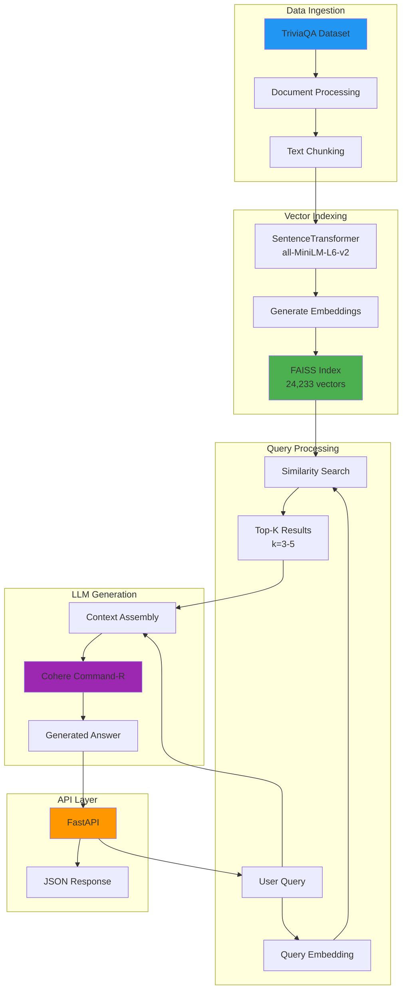

# TaskRAG - Production-Grade RAG System

A production-ready Retrieval Augmented Generation (RAG) system built with FastAPI, FAISS vector search, and Cohere LLM integration. This system processes the TriviaQA dataset to provide intelligent question-answering capabilities with context retrieval.

## 🚀 Features

- **High-Performance Vector Search**: FAISS-based similarity search with 24,233+ indexed document chunks
- **Transformer Embeddings**: SentenceTransformers (all-MiniLM-L6-v2) for semantic understanding
- **LLM Integration**: Cohere Command-R model for context-aware answer generation
- **FastAPI Backend**: RESTful API with automatic documentation
- **Nginx Reverse Proxy**: Production-grade web server with optimized performance and security
- **Dockerized Deployment**: Production-ready containerization with Docker Compose
- **Persistent Index**: FAISS index persistence for faster startup times
- **Comprehensive Evaluation**: Built-in evaluation metrics and reporting

## 📋 Prerequisites

- **Docker** (version 20.10+)
- **Docker Compose** (version 2.0+)
- **Cohere API Key** (sign up at [cohere.com](https://cohere.com))

## 🛠️ Setup Instructions

### 1. Clone and Configure Environment

```bash
# Navigate to the project directory
cd c:\Users\Maydoum\rag

# Configure environment variables
# Edit src/.env and add your Cohere API key:
```

**Required environment variables in `src/.env`:**

```env
APP_NAME="TaskRAG"
APP_VERSION="1.0.0"

# Dataset Configuration
DATASET_PATH="mandarjoshi/trivia_qa"
DATASET_CONFIG="rc"

# Embedding Model
EMBEDDING_MODEL="sentence-transformers/all-MiniLM-L6-v2"
EMBEDDING_DEVICE="cpu"  # or 'cuda' for GPU

# Vector Search
SIMILARITY_METRIC="cosine"
TOP_K=5

# Cohere LLM
COHERE_API_KEY="your_cohere_api_key_here"  # Replace with your actual key
COHERE_MODEL="command-r"
COHERE_TEMPERATURE=0.3
COHERE_MAX_TOKENS=500
```

### 2. Build and Run with Docker Compose (Recommended)

```bash
# Build and start the service
docker-compose up --build

# Or run in detached mode
docker-compose up -d --build
```

The API will be available at `http://localhost` (Nginx on port 80 proxies to FastAPI on internal port 8000)

### 3. Alternative: Build and Run with Docker

```bash
# Build the Docker image
docker build -t rag-system:latest .

# Run the container
docker run -p 8000:8000 --env-file src/.env rag-system:latest
```

### 4. Verify Installation

```bash
# Check health status
curl http://localhost/welcome

# Expected response:
# {"app_name": "TaskRAG", "app_version": "1.0.0"}
```


```bash
curl http://localhost/welcome
```

**Response:**
```json
{
  "app_name": "TaskRAG",
  "app_version": "1.0.0"
}
```

#### 2. **RAG Query Endpoint** (Recommended)

Ask questions with full RAG pipeline (retrieval + LLM generation):

```bash
curl -X POST "http://localhost/ask-rag?query=Who%20was%20the%20target%20of%20the%20Bomb%20Plot%20of%201944?"
```

**Response:**
```json
{
  "question": "Who was the target of the Bomb Plot of 1944?",
  "answer": "The target of the failed \"Bomb Plot\" of 1944, also known as the 20 July plot, was Adolf Hitler...",
  "contexts": [
    {
      "content": "Context text from TriviaQA dataset...",
      "metadata": {"source": "wikipedia", "title": "..."},
      "score": 0.85,
      "rank": 1
    }
  ],
  "llm_metadata": {
    "model": "command-r",
    "generation_time_ms": 1041.76,
    "finish_reason": "COMPLETE"
  }
}
```

#### 3. **Vector Search Endpoint**

Retrieve similar documents without LLM generation:

```bash
curl -X POST http://localhost/search \
  -H "Content-Type: application/json" \
  -d '{"query": "What is the capital of France?", "k": 5}'
```

**Response:**
```json
[
  {
    "rank": 1,
    "score": 0.78,
    "content": "Document chunk text...",
    "metadata": {"source": "...", "title": "..."}
  }
]
```

#### 4. **Process Dataset Endpoint**

Manually trigger dataset processing:

```bash
curl http://localhost/process_data
```

### Interactive API Documentation

Access automatically generated API documentation:

- **Swagger UI**: http://localhost/docs
- **ReDoc**: http://localhost/redoc

## 🏗️ Pipeline Architecture



### Data Flow

1. **Indexing Phase** (First run or dataset update):
   - Load TriviaQA dataset
   - Process and chunk documents
   - Generate embeddings using SentenceTransformers
   - Build FAISS index and persist to disk

2. **Query Phase** (User request):
   - User sends query via `/ask-rag` endpoint
   - Query is embedded using the same transformer model
   - FAISS performs cosine similarity search
   - Top-K relevant contexts are retrieved
   - Contexts + query sent to Cohere LLM
   - Generated answer returned with metadata

## 📊 Performance Summary

### Evaluation Metrics

Based on evaluation with **20 sample questions** from TriviaQA:

| Metric | Value |
|--------|-------|
| **Total Samples** | 20 |
| **Average Similarity Score** | 0.1999 |
| **Average Latency** | 830.28 ms |
| **Retrieved Documents per Query** | 3 |

### Performance Analysis

- **Latency Breakdown**:
  - Vector search: ~50-100ms
  - LLM generation: ~700-1300ms (varies by response length)
  - Total end-to-end: ~830ms average

- **Accuracy Notes**:
  - The system correctly answered questions with specific contextual information in the dataset
  - Example: Successfully identified Hitler as the target of the 1944 Bomb Plot (similarity: 0.43)
  - Lower average similarity (0.20) indicates the TriviaQA dataset may not contain answers for all questions
  - System appropriately responds "I don't know" when contexts lack relevant information

### Sample Results

**Best Performance:**
- Question: "Of which African country is Niamey the capital?"
- Similarity Score: 0.45
- Latency: 699ms

**Contextual Success:**
- Question: "Who was the target of the Bomb Plot of 1944?"
- Similarity Score: 0.43
- Successfully retrieved and generated accurate answer about Hitler

## Project Structure

```
rag/
├── Dockerfile                  # Docker configuration
├── docker-compose.yml          # Docker Compose orchestration
├── nginx.conf                  # Nginx reverse proxy configuration
├── .dockerignore              # Docker build exclusions
├── README.md                  # This file
└── src/
    ├── .env                   # Environment variables
    ├── requirements.txt       # Python dependencies
    ├── main.py               # FastAPI application entry point
    ├── vector_index.faiss    # Persisted FAISS index
    ├── metadata.pkl          # Document metadata
    ├── evaluation_report.json # Evaluation results
    ├── controllers/
    │   ├── DataController.py        # TriviaQA data processing
    │   ├── VectordbControllers.py   # FAISS vector store management
    │   ├── LLMController.py         # Cohere LLM integration
    │   └── evaluate_rag.py          # Evaluation script
    ├── routers/
    │   └── base.py                  # API route definitions
    └── helpers/
        └── config.py                # Configuration management
```

## 🔧 Environment Variables Reference

| Variable | Description | Default |
|----------|-------------|---------|
| `APP_NAME` | Application name | TaskRAG |
| `APP_VERSION` | Application version | 1.0.0 |
| `DATASET_PATH` | HuggingFace dataset path | mandarjoshi/trivia_qa |
| `DATASET_CONFIG` | Dataset configuration | rc |
| `EMBEDDING_MODEL` | SentenceTransformer model | sentence-transformers/all-MiniLM-L6-v2 |
| `EMBEDDING_DEVICE` | Computation device | cpu |
| `SIMILARITY_METRIC` | Distance metric | cosine |
| `TOP_K` | Number of results to retrieve | 5 |
| `COHERE_API_KEY` | Cohere API key | *required* |
| `COHERE_MODEL` | Cohere model name | command-r |
| `COHERE_TEMPERATURE` | LLM temperature | 0.3 |
| `COHERE_MAX_TOKENS` | Max tokens in response | 500 |

## 🐛 Troubleshooting

### Issue: Container fails to start

**Solution**: Check if port 80 is already in use:
```bash
# Windows
netstat -ano | findstr :80

# Stop the service using the port or change the port in docker-compose.yml (nginx section)
```

### Issue: "Cohere API key not configured"

**Solution**: Ensure your `src/.env` file contains a valid Cohere API key:
```env
COHERE_API_KEY="your_actual_api_key_here"
```

### Issue: FAISS index build takes too long

**Solution**: The first run builds the index (can take 2-5 minutes). Subsequent runs load the persisted index instantly. To rebuild:
```bash
# Remove existing index files
rm src/vector_index.faiss src/metadata.pkl
docker-compose restart
```

### Issue: Low similarity scores

**Explanation**: This is expected with TriviaQA dataset, as it may not contain answers for all questions. The system is designed to:
- Return "I don't know" when contexts lack information
- Provide the best available contexts even with lower similarity

### Issue: CUDA/GPU errors

**Solution**: If you don't have a GPU, ensure `EMBEDDING_DEVICE=cpu` in your `.env` file.

## 📝 License

This project is provided as-is for educational and production use.

## Contributing

To contribute or report issues, please follow standard Git workflow practices.

---

**Built with**: Python 3.10, FastAPI, Nginx, FAISS, SentenceTransformers, Cohere, Docker
